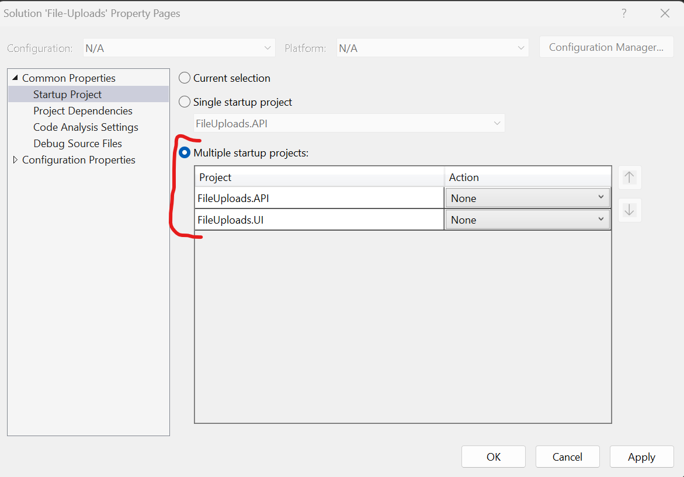

# Multipart Request - File Uploads
This demo shows how to use the built in extension to support the [graphql multipart request specification](https://github.com/jaydenseric/graphql-multipart-request-spec).

## Documentation
View the official documentation for the [multi-part request extension](https://graphql-aspnet.github.io/docs/server-extensions/file-uploads) GraphQL ASP.NET.

This project uses jaydenseric's[apollo upload client](https://github.com/jaydenseric/apollo-upload-client) example project targeting a GraphQL ASP.NET server instance to demonstrate the fileupload capabilities of the library.

## Starting the Demo Project
1. Opening the solution
2. Right click on the solution and choose `Configure Startup Projects`. 
3. Make sure that both the API and UI projects are set to start.

4. Press F5 to run the solution.

_Note: The UI for this project uses nextjs it may take a moment for the npm packages to download and for the client app to build when you first launch it._