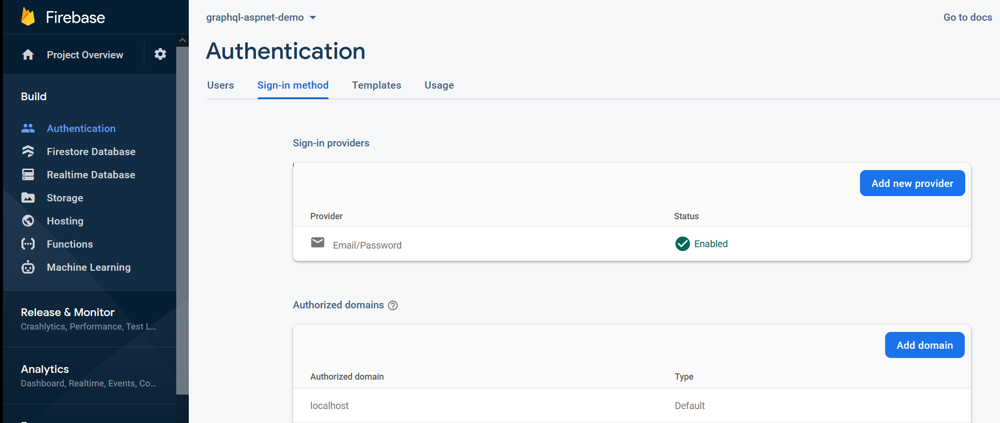
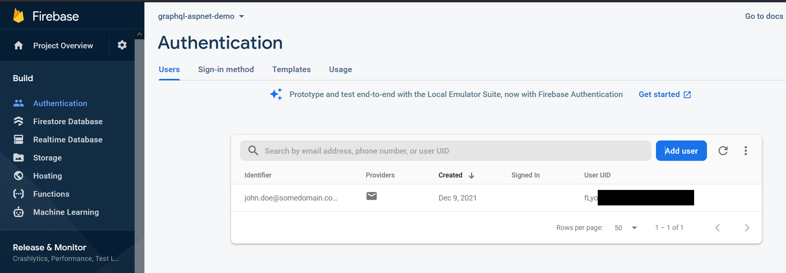
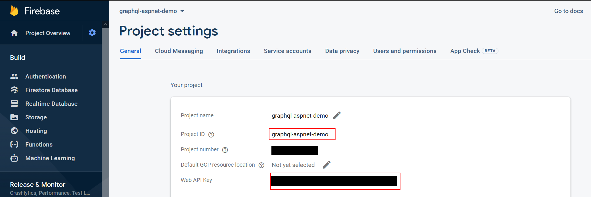
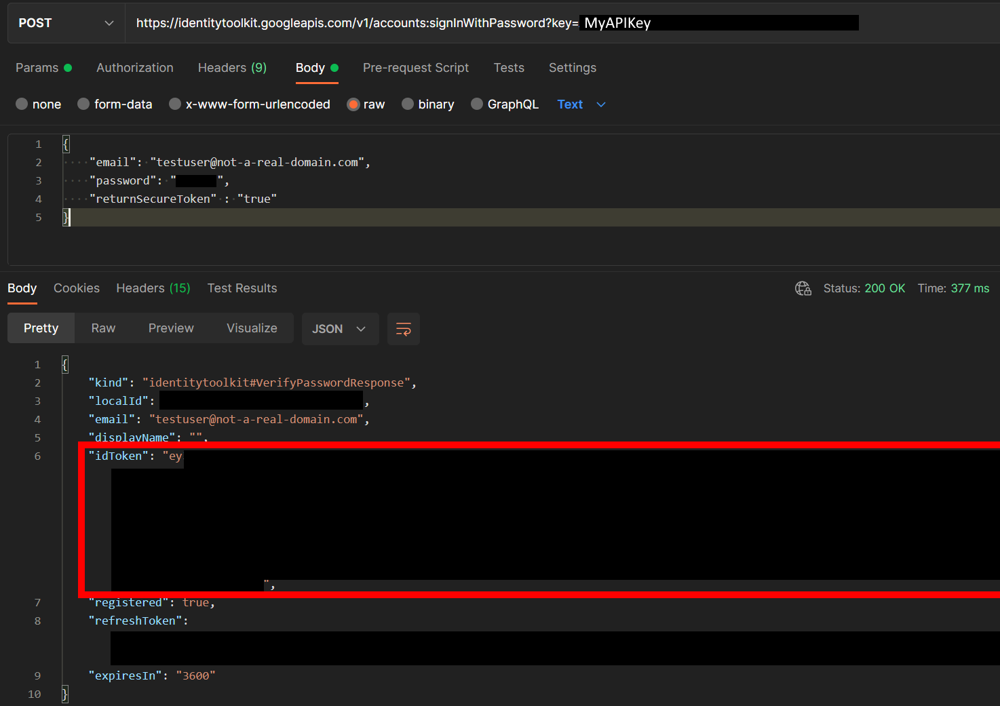
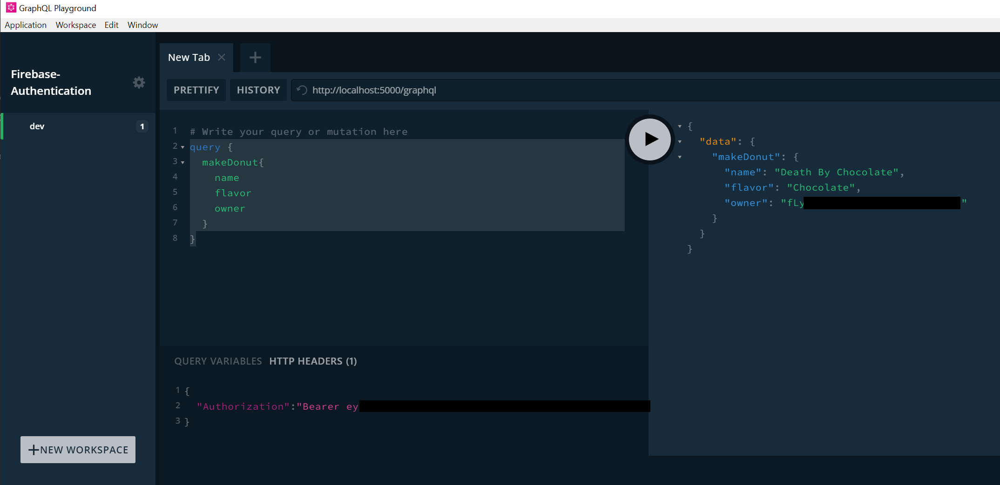

This demo will briefly walk you through how to setup authentication on a firebase project then consume an oauth2 access token within your graphql project to authorize a user to a graphql end point.

This demo does NOT cover any details on how to obtain tokens or grant permissions to a user in web or mobile. Those details would be specific to your front end of choice and are beyond the scope of this demo.

# Setup Firebase Authentication
Before we can consume an access token in our graphql project we first need to setup a firebase project to act as a container for our user accounts. This is similar to integrating with Identity Server, Azure AD etc. Firebase is free to use and relatively painless to setup.

## **1. Create a Firebase Project**
- Navigate to the [Firebase Console](https://console.firebase.google.com/) and create a new project. Take note of the project id you assign to your new project, you'll need it later.


## **2. Enable Authentication**

 - With your project active click on **Authentication** on the left hand side then click **Sign In Method**
 - Add the *Email/Password* native provider



## **3. Add a User Account**

 -  Click on the *Users* tab and add a new user. 
    - Note the User UID, we'll be able to see it in our project to verify the user is authenticated correctly.
  


##  **4. Copy the Project Id and Web API Key**
- Click on **Project Overview** -> **Gear Icon** -> **Project Settings** and copy the Project ID and the Web API Key
- Note: Keep your Web API Key a secret
  


## **5. Configure The Demo Project**
* Open up the demo project and navigate to `appsettings.json`
* Replace the value `firebaseProjectId` with your project id
* Note: There are a number of configuration options within `startup.cs` that you can use to configure how your project validates tokens from firebase. 
```json
{
  "firebaseProjectId":  "graphql-aspnet-demo"
}
```
## **6. Obtain a JWT access_token for your user**
 - Open your http tester of choice, such as [Postman](https://www.postman.com/).
 - Issue a POST request to the below URL and with the following body to obtain a JWT access token for your test user
   - Be sure to add your specific api key in the url
   - Be sure to supply your test user's email and expected password
- Copy the returned `idToken`


```js
// Be sure to update YOUR-WEB-API-KEY with your unique key from step 4
POST: "https://identitytoolkit.googleapis.com/v1/accounts:signInWithPassword?key=YOUR-WEB-API-KEY"
```
```json

{
  "email": "testuser@not-a-real-domain.com",
  "password": "THE_USERS_PASSWORD",
  "returnSecureToken": "true"
}
```



# Make a Donut
- Run the demo project and execute the following query in a tool of your choice

Use a GraphQL tool submit the graphql requests. Don't forget to include the authorization header with the bearer token obtained from step 6 above.

```graphql
query {
  makeDonut{
    name
    flavor
    owner
  }
}
```


Note that the user's UID from Firebase is successfully read from the token and returned back on the query.

> See the `BakeryController` in the project for more details.